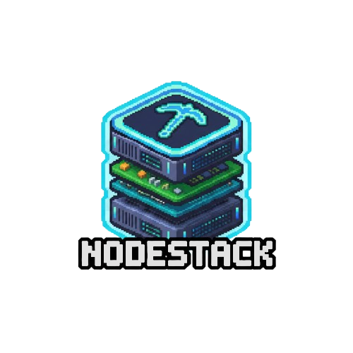

<div align="center">
<p align="center">
  
</p>
# NodeStack
### Next-Gen Minecraft Server Management

<p align="center">
  
  
  
</p>
<p align="center">
  
  
</p>

**Futuristic design • Node.js powered • Seamless Minecraft management**

<a href="#features">Features</a> • <a href="#installation">Installation</a>
</div>

<br>


## Features

<table>
  <tr>
    <td width="50%">

### Modern UI/UX
- **Sleek Design**: An intuitive, responsive, and visually appealing interface built for the modern web.
- **Customizable Themes**: Personalize your panel experience with a variety of built-in themes and color schemes.
- **Real-time Dashboards**: Get instant insights into your server's health and performance metrics.

    </td>
    <td width="50%">

### Powerful Backend
- **Node.js Powered**: Leveraging the speed and scalability of Node.js for a performant and efficient panel.
- **Secure Architecture**: Built with modern security practices to protect your servers and data.
- **Extensible**: Designed with modularity in mind, making it easy to extend and integrate new features.

    </td>
  </tr>
  <tr>
    <td width="50%">

### Comprehensive Server Control
- **Full Lifecycle Management**: Effortlessly start, stop, restart, and kill your Minecraft servers.
- **Integrated File Manager**: Browse, edit, upload, and download server files directly from the panel.
- **Console Access**: Real-time server console with input capabilities.

    </td>
    <td width="50%">

### User & Permissions
- **Granular Access Control**: Define precise permissions for different users and roles.
- **Multi-User Support**: Allow multiple users to manage their respective servers or parts of a single server.
- **Audit Logs**: Keep track of all actions performed by users on the panel.

    </td>
  </tr>
</table>

<div align="center">
## Installation
</div>

To get NodeStack up and running, follow these steps:

1.  **Clone the repository:**
    ```bash
    git clone https://github.com/St4ndd/NodeStack.git
    cd NodeStack
    ```

2.  **Install dependencies:**
    ```bash
    npm install
    ```

3.  **Build the project:**
    ```bash
    npm install -g pkg
    npm run make-exe
    ```
    
4.  **Start the server in dev mode:**
    ```bash
    npm run dev
    ```

## Port Forwarding

For NodeStack and the managed Minecraft server to be accessible from the public internet, you must configure **port forwarding** on your router. This directs incoming traffic on specific ports to the machine running NodeStack and the Minecraft server.

### Essential Ports

| Component | Default Port | Description |
| :--- | :--- | :--- |
| **Minecraft Server** | **25565** (TCP) | Allows players to connect to your Minecraft game server. |
| **NodeStack Panel** | **3001** (TCP) | Allows you to access the NodeStack web management interface. |

### Optional Ports (For Common Extensions)

If you use any of the following popular server extensions, you will need to forward their respective default ports as well:

| Extension | Default Port | Description |
| :--- | :--- | :--- |
| **Dynmap** | **8123** (TCP) | For the real-time, in-browser map view. |
| **BlueMap** | **8100** (TCP) | For the 3D, high-performance map viewer. |

> **Note:** The specific steps for port forwarding vary between router models. Consult your router's documentation for detailed instructions. Ensure the ports are forwarded to the **internal IP address** of the machine hosting NodeStack.


NodeStack should now be running! Access it via your browser at the configured port (e.g., `http://localhost:3001`).


```
NodeStack is a solo project, and while I strive for perfection, I recognize that there might be some unconventional code paths.
 Thank you for understanding!

Your feedback is invaluable:
If you encounter any bugs, run into issues, or have suggestions, please don't hesitate to open an issue or reach out.
```
